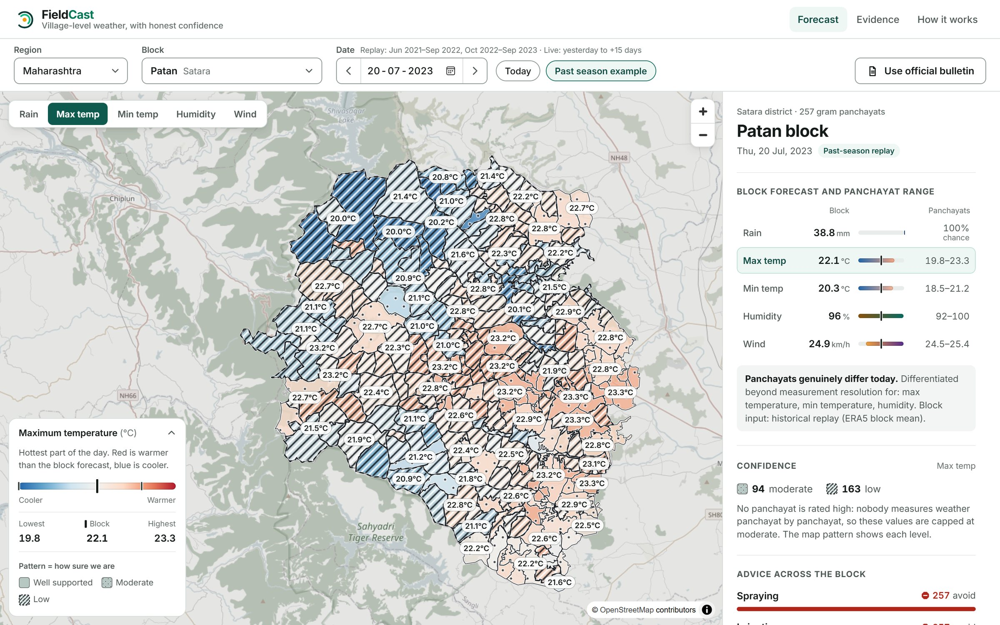
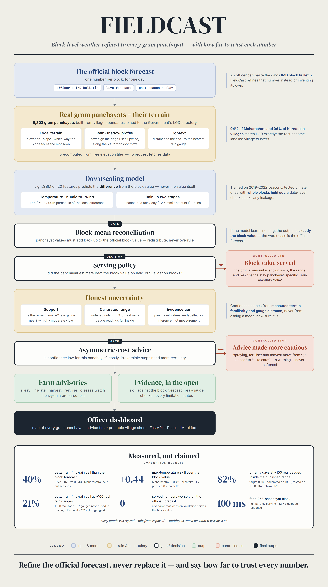
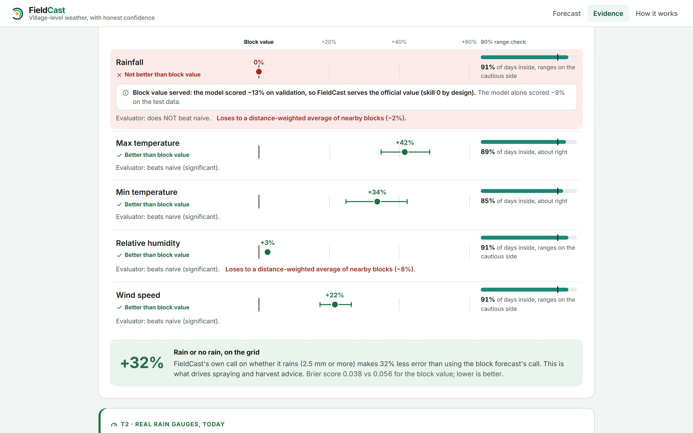
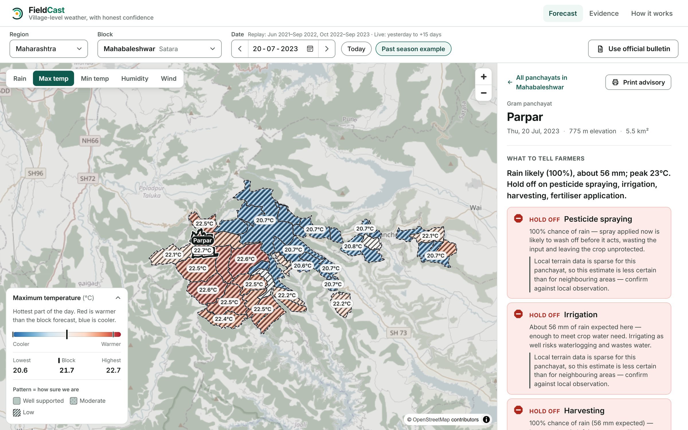

<p align="center">
  
</p>

<h3 align="center">Village-level weather, with honest confidence.</h3>

<p align="center">
  FieldCast downscales official block-level weather forecasts to every <b>gram panchayat</b>,<br />
  so agro-met advice can follow the terrain, and says how far to trust every number.
</p>

<p align="center">
  
  
  
  
  
  
  
  <br />
  
  
  
  
  
  
  <br />
  
  
  
  
  
  
</p>

<p align="center">
  
  <sub>Patan block, 257 gram panchayats. Colour is the difference from the block forecast; hatching marks where confidence is low.</sub>
</p>

> Built for **Smart India Hackathon**, problem statement **SIH26074** (Ministry of Earth Sciences, theme: Disaster Management): *Downscaling of weather forecast from Block level to Panchayat level for agro-meteorological advisory services.*

## Why it matters

Agro-met advisories in India are issued per **block**, but one block can span a
ridge, a valley and a rain shadow. Across the Western Ghats a windward slope can
get a downpour while a village a few kilometres downwind stays dry, yet both get
the same spraying, irrigation and harvest advice.

Two things make this harder than interpolation. Rainfall is not a smooth field,
and **there is almost no panchayat-scale ground truth**. So FieldCast delivers
the panchayat value **and** how far to trust it.

## What it does

- **Refines, never replaces, the official forecast.** It predicts each
  panchayat's difference from the block value, and the panchayats always add
  back up to it.
- **Serves real gram panchayats.** It covers 9,802 of them across 134 blocks in
  Maharashtra and Karnataka, built from village boundaries joined to the
  Government's LGD directory.
- **Gives every number a range and a confidence level.** Each value has a
  calibrated 80% range, a support level (high / moderate / low) and an
  evidence tier.
- **Treats rain honestly.** It gives a chance of rain plus an *if-it-rains*
  amount range, not one misleading number.
- **Gives cautious farm advice.** Spraying, irrigation, harvest, fertiliser and
  heavy-rain advice move from *go ahead* to *take care* where confidence is low.
- **Accepts the officer's IMD bulletin.** An officer can type the official block
  forecast and get it downscaled instantly.

## How it works

<p align="center">
  
</p>

1. **Input.** Take the official block forecast: an IMD bulletin, a live
   forecast or a past-season replay.
2. **Describe each panchayat.** Terrain features include elevation, slope,
   monsoon-facing aspect, the ridge height upwind, and the distance to the coast
   and to a rain gauge.
3. **Downscale.** LightGBM quantile models predict each panchayat's *difference*
   from the block value. Rain uses two stages: the chance of a rainy day, then
   the amount if it rains.
4. **Reconcile.** Panchayat values are adjusted so their area-weighted mean
   equals the block value.
5. **Quantify trust.** Ranges are calibrated against real rain gauges, and
   support comes from how familiar the terrain is and how near a gauge is.
6. **Advise.** Farm advice becomes more cautious wherever confidence is low.

## Why it works

| Design choice | Why |
|---|---|
| Predict the **anomaly**, not the value | If the model learns nothing, the output is exactly the official forecast |
| **Rain-shadow features** along the 245° monsoon flow | A village's rain shadow comes from the ridge upwind of it, not its local slope |
| **Two-stage rainfall** (IMD rainy day ≥ 2.5 mm, then amount) | One regressor smears drizzle everywhere; two stages allow "dry here, wet next door" |
| **Block-mean reconciliation** | Keeps every panchayat map consistent with the official block forecast |
| **Serving policy decided on validation** | If the model can't beat the block value for a variable, the block value is served |
| **Epistemic support** (chi-square-scaled Mahalanobis + gauge distance) | Tree models extrapolate with false confidence; unfamiliar terrain widens the range and downgrades advice |
| **Gauge-calibrated ranges** | "80% range" means ~80% of real gauge readings fall inside it |
| **Asymmetric-cost advice** | Irreversible steps like spraying or harvest need more certainty than reversible ones |
| **Numpy-only serving** | Trees are flattened into arrays (identical to ~1e-15), so the API runs without LightGBM, pandas or SciPy: ~100 ms for a 257-panchayat block |

## Results

Tested on seasons and whole blocks the model never saw (2022-23 dry season and
2023 monsoon), against the obvious baseline of copying the block value to every
panchayat. Skill = 1 − MAE(model) / MAE(block copy); 1 is perfect, 0 is no
better. 90% confidence intervals come from cluster bootstraps.

| | Maharashtra | Karnataka |
|---|---:|---:|
| Max temperature skill | **+0.44** [0.40, 0.48] | **+0.42** [0.35, 0.49] |
| Min temperature skill | **+0.28** [0.24, 0.32] | **+0.34** [0.25, 0.42] |
| Relative humidity skill | +0.19 | +0.03 |
| Wind speed skill | +0.05 | +0.22 |
| Rain / no-rain error (Brier) | **0.026** vs 0.043 (**40% lower**) | **0.038** vs 0.056 (**32% lower**) |
| Rain amount | block value served | block value served |

- **At real rain gauges never used in training**, the rain / no-rain call is
  23% better than the block forecast in Maharashtra and 18% better in Karnataka.
  Also, 80–81% of wet gauge-days fall inside the published range, against a
  target of 80%.
- **Rain amounts did not beat the block value**, so FieldCast serves the
  official amount and adds the panchayat's own rain chance and range. Nothing
  served was worse than the block forecast on validation.
- **Every loss is published too**, on the app's Evidence page and in
  [`reports/`](reports/).

<p align="center">
  
</p>

## The dashboard

<p align="center">
  
</p>

Built for a block agriculture officer on a laptop or a phone:
- **Advice comes first**, in plain words: ✓ go ahead · ⚠ take care · ⛔ hold off.
- **Colour shows the value and texture shows confidence**, so the two can never
  be confused.
- **Each panchayat has weather cards and a "How sure are we?" panel.** Every
  value has its range and the block value marked.
- **Officers can print a one-page advisory** for a panchayat noticeboard.
- **Past seasons can be replayed**, and live forecasts run from yesterday to
  +15 days.
- **It's accessible.** Keyboard accessible, colour-blind-safe palettes, and a
  mobile layout.

## Tech stack

| Layer | Tools |
|---|---|
| Modelling | Python · LightGBM (quantile regression) · scikit-learn (isotonic calibration) · pandas · GeoPandas · Shapely |
| API | FastAPI · pydantic · numpy-only runtime |
| Dashboard | React 18 · TypeScript (strict) · Vite · MapLibre GL · OpenStreetMap |
| Quality | 231 pytest + 177 Vitest tests · Ruff · ESLint |
| Hosting | Vercel |

## Getting started

```bash
python -m venv .venv
.venv/Scripts/python -m pip install -e ".[serve,pipeline,dev]"   # .venv/bin/python on macOS/Linux
cd frontend && npm install && npm run build && cd ..
.venv/Scripts/python -m uvicorn backend.app.main:app --port 8000
```

Open **http://localhost:8000**: one process serves the API and the dashboard.

```bash
.venv/Scripts/python -m pytest -q          # backend tests
cd frontend && npm test && npm run lint    # frontend tests and lint
```

<details>
<summary><b>Rebuild the data and models</b></summary>

```bash
# LGD "Village To Gram Panchayat Mapping" exports go in data/raw/lgd/ first.
python -m backend.pipeline.build_base --region mh_ghats                 # blocks, panchayats, gauges
python -m backend.pipeline.fetch --region mh_ghats --region ka_ghats    # weather history (resumable)
python -m backend.pipeline.train --region mh_ghats                      # models
python -m backend.pipeline.evaluate.run --region mh_ghats               # evaluation reports
python -m backend.serve.export --region mh_ghats --region ka_ghats      # serving bundle
```
</details>

<details>
<summary><b>Project structure</b></summary>

```
backend/
  app/          FastAPI routes, schemas, advisory rules
  serve/        numpy-only runtime and bundle export
  pipeline/     geo · sources · features · models · evaluate
  tests/
frontend/src/   components · lib · hooks · api · styles
serve_bundle/   model bundle the deployed API reads
reports/        evaluation reports
docs/           architecture, design decisions, flowchart
```
</details>

## Limitations

- Panchayat-level values are inference: no panchayat-scale measurements exist to
  check them against, and every response says so.
- Modern rain gauges are scarce (3–4 per state in these blocks), so gauge
  results are not yet statistically significant. A ~100-gauge historical test is
  built into the evaluation.
- The models learn from ERA5 reanalysis, not IMD operational forecasts. IMD
  bulletins can be supplied at run time.
- About 5% of villages have no LGD gram-panchayat match and are served as
  labelled village clusters.

## Data sources

[Open-Meteo](https://open-meteo.com) (ERA5, forecasts; CC BY 4.0) ·
[AWS Terrain Tiles](https://registry.opendata.aws/terrain-tiles/) ·
[Natural Earth](https://www.naturalearthdata.com) ·
[GADM 4.1](https://gadm.org) ·
[datameet village boundaries](https://github.com/datameet/indian_village_boundaries) (CC BY 4.0) ·
[LGD, Government of India](https://lgdirectory.gov.in) ·
[NOAA GHCN-Daily](https://www.ncei.noaa.gov/products/land-based-station/global-historical-climatology-network-daily) ·
[OpenStreetMap](https://www.openstreetmap.org/copyright) (ODbL)

## License

[MIT](LICENSE)
